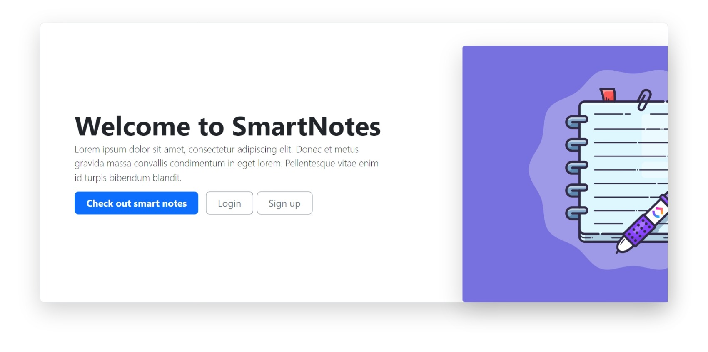
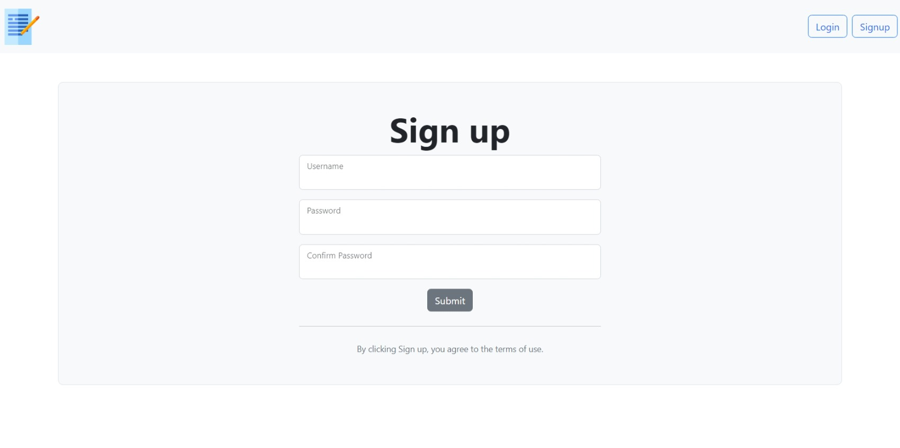
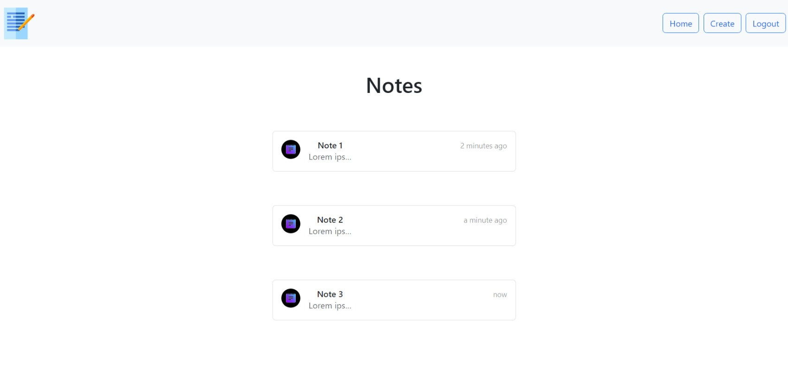
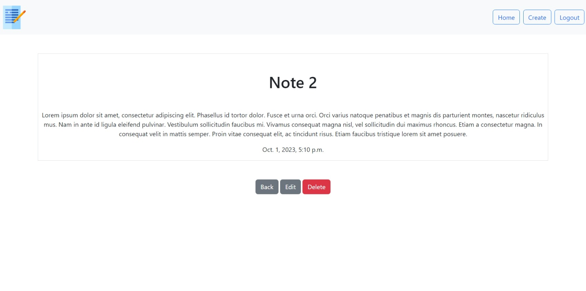
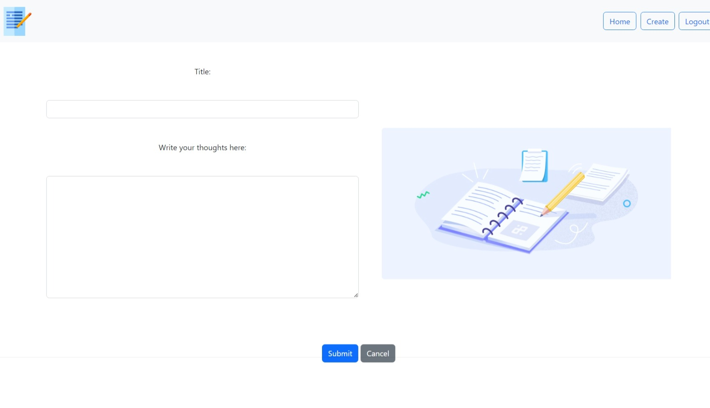

# SmartNotes - Your Note-Taking Companion

SmartNotes is a web application that simplifies note-taking and organization. It was developed using Python/Django, HTML, CSS, and Bootstrap to provide an efficient and user-friendly experience for managing your notes.

## How It Works

1. **Account Creation and Login**:
   - To get started, users must either create a new account or log in if they already have one. This ensures the security and privacy of their notes.
   

2. **Notes Dashboard**:
   - After logging in, users are redirected to the Notes Dashboard, where they can manage all their notes.
   

3. **View/Update/Delete Notes**:
   - Users can easily view/update/delete all their notes listed on the dashboard. 
   

4. **Create New Notes**:
   - Adding new notes is a breeze. With just a click, users can create a new note and start jotting down their thoughts, ideas, or important information.
   